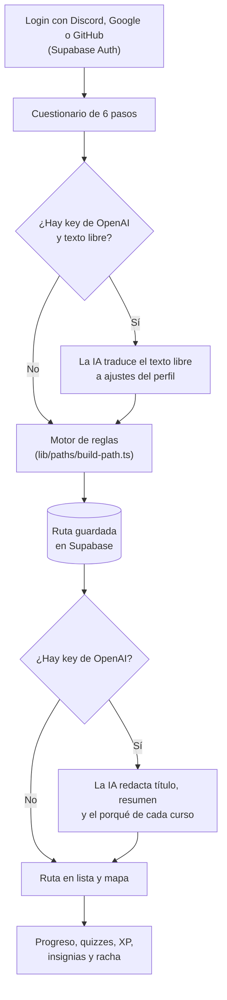

<p align="center">
  
</p>

<h1 align="center">DevPathlles</h1>

<p align="center">
  Tu ruta de aprendizaje, armada con los cursos reales de <a href="https://cursos.devtalles.com">DevTalles</a>.
</p>

---

DevPathlles es un **generador de rutas de aprendizaje personalizadas**. Respondes un cuestionario
corto (qué quieres lograr, qué ya sabes, qué te interesa y cuánto tiempo tienes) y la app te arma
una ruta ordenada con los **74 cursos activos** y las **15 rutas oficiales** de DevTalles: qué curso
hacer primero, cuál después, cuántas horas lleva cada uno y por qué está ahí. Después la recorres,
marcas tu progreso, validas cada curso con un quiz y ganas XP, niveles, insignias y racha.

La ruta la arma siempre un **motor de reglas propio**, así que la app funciona completa sin
inteligencia artificial. Si hay una key de OpenAI, la **IA personaliza encima**: interpreta lo que
escribiste con tus palabras y explica cada elección.

## Índice

- [Qué puedes hacer](#qué-puedes-hacer)
- [Cómo funciona](#cómo-funciona)
- [Stack](#stack)
- [Supabase: para qué lo usamos](#supabase-para-qué-lo-usamos)
- [Variables de entorno y llaves](#variables-de-entorno-y-llaves)
- [Cómo levantarlo en local](#cómo-levantarlo-en-local)
- [Recorrido sugerido para probarla](#recorrido-sugerido-para-probarla)
- [Comandos](#comandos)
- [Estructura del repo](#estructura-del-repo)
- [Cómo trabajamos](#cómo-trabajamos)
- [Equipo y licencia](#equipo-y-licencia)

## Qué puedes hacer

- **Responder un cuestionario de 6 pasos** y obtener una ruta ordenada, con las horas de cada curso,
  agrupada en tramos (Primeros pasos, Intermedio, Avanzado) y ajustada a tu tiempo disponible.
- **Ver la ruta en lista o en mapa**: un camino en zigzag con cada curso como estación, y el
  detalle de cada paso (qué aprendes, por qué está en tu ruta, link al curso).
- **Marcar tu progreso** (Pendiente, En curso, Hecho) y **aprobar el quiz de cada curso** para
  darlo por terminado.
- **Ganar XP, subir de nivel, desbloquear insignias y sostener una racha** diaria. Todo se ve en tu
  perfil (`/profile`), con una celebración al completar pasos y rutas.
- **Tener varias rutas** a la vez y verlas todas en tu dashboard (`/dashboard`).
- **Compartir una ruta** con un link público (`/shared/[slug]`) que se ve como tarjeta en Discord.
  Quien la abre puede copiarla a su cuenta con el progreso en cero.
- **Administrar el catálogo** desde `/admin` (solo con rol admin): cursos, rutas oficiales, quizzes,
  requisitos entre cursos e intereses. Esas reglas alimentan al motor, sin tocar código.
- **Explorar el sistema de diseño** en `/sistema-diseno`: la paleta, la tipografía y los componentes
  de la app.

## Cómo funciona



### 1. El cuestionario

Seis pasos, en este orden:

| Paso | Qué preguntamos |
|---|---|
| Tu meta | Qué quieres lograr: React, Vue, Angular, Node, NestJS, Java, C#, Python, PHP, Go, combinaciones fullstack (React + Nest, Vue + Node…), móvil (Flutter, React Native) o IA. |
| Tu nivel | Empiezo de cero, tengo bases o nivel intermedio. |
| Ya dominas | Tecnologías que ya manejas (JavaScript, TypeScript, Git, SQL, Docker…), para no repetir lo que sabes. |
| Te interesa | Temas transversales: testing, Docker, SOLID y Clean Code, patrones de diseño, bases de datos, tiempo real, microservicios, IA aplicada… |
| Tu tiempo | Horas por semana (de 3 a 40) y plazo (3, 6, 9 o 12 meses). |
| Cuéntanos más | Texto libre y opcional: tu meta con tus palabras. Solo lo usa la IA. |

### 2. El motor de reglas

Vive en `lib/paths/build-path.ts` y es una **función pura**: recibe tus respuestas, el catálogo y
las reglas que carga el admin, y devuelve la ruta. No llama a la red ni a la IA, así que siempre da
el mismo resultado para las mismas respuestas y se prueba con tests unitarios.

1. **Parte de las rutas oficiales de tu meta.** Cada ruta oficial de DevTalles marca sus cursos como
   requeridos, recomendados u opcionales. Si eliges una meta fullstack, combina dos rutas.
2. **Pone la base si empiezas de cero.** Los cursos de Fundamentos (editables desde el admin) van
   primero para quien no sabe programar.
3. **Saca lo que ya dominas** y suma los cursos de los intereses que marcaste.
4. **Ordena por requisitos entre cursos.** Cada curso puede "necesitar" o "convenirle" otro antes.
   El motor respeta esas dependencias y, a igualdad, va de menor a mayor dificultad.
5. **Recorta a tu tiempo.** Si la ruta no entra en tus horas, primero salen los cursos de interés,
   después los opcionales y al final los recomendados. **Lo requerido nunca se recorta.** Los cursos
   que salieron se muestran aparte, con el motivo.
6. **Agrupa la ruta en tramos:** Primeros pasos, Intermedio y Avanzado.

### 3. La IA encima (opcional)

Vive en `lib/ai/` y usa el Vercel AI SDK con OpenAI. Hace tres cosas, todas con salida estructurada
y validada con zod:

- **Antes del motor:** lee tu texto libre y lo traduce a ajustes de las listas cerradas del
  cuestionario (cambiar la meta, sumar o quitar intereses y tecnologías). Nunca elige cursos sueltos
  ni toca tu nivel o tu tiempo.
- **Después del motor:** redacta un título, un resumen y el porqué de cada curso de tu ruta. El
  schema solo acepta cursos que eligió el motor, así que la IA no puede inventar ni meter cursos.
- **En el admin:** sugiere requisitos entre cursos, para que el admin los revise y acepte.

Si no hay key, si la IA tarda o si responde algo inválido, **la ruta queda exactamente como la armó
el motor**: la generación nunca se bloquea por la IA. Para cuidar el costo, cada usuario tiene
**5 personalizaciones cada 24 horas**.

### 4. Progreso, quizzes, XP y racha

Cómo se integran los quizzes y la racha con el mapa de la ruta está en
[`docs/decisiones/0005-quizzes-y-racha-unificados.md`](docs/decisiones/0005-quizzes-y-racha-unificados.md),
y por qué los quizzes se escriben desde el panel, sin IA, en
[`docs/decisiones/0006-quizzes-de-curso-escritos-por-el-admin.md`](docs/decisiones/0006-quizzes-de-curso-escritos-por-el-admin.md).

- **Quizzes por curso.** Cada curso tiene un quiz que el admin escribe y edita en
  `/admin/courses/[slug]/quiz`. Las migraciones traen 3 preguntas básicas para cada uno de los 74
  cursos, así que hay quizzes desde el primer momento.
- **Feedback al instante.** El quiz se abre desde el detalle de cada paso del mapa o desde la lista.
  Al elegir una opción queda fija y se ve si es correcta, cuál era la correcta y por qué.
- **Aprobar para terminar.** Se aprueba con el porcentaje de cada quiz (60 % por defecto). En un
  curso con quiz, marcarlo como "Hecho" exige aprobarlo.
- **Sin trampas.** Al entregar, Postgres vuelve a corregir el intento y lo guarda. Los intentos y el
  progreso son privados (RLS); los quizzes los lee cualquier usuario con sesión y solo los escribe el
  admin.
- **XP y niveles.** Cada curso terminado da 10 XP por hora de duración; cada nivel cuesta un poco
  más que el anterior. El XP se calcula al leer tu progreso, no se guarda aparte.
- **Insignias:** Primer paso, Primer curso, Ruta completa, Explorador, Constancia y Maratonista.
- **Racha.** Suma como máximo un día por fecha local al aprobar un quiz o al pasar un paso a
  "En curso" o "Hecho".

### 5. El panel de administración

`/admin` solo lo ven los usuarios con rol `admin`. Desde ahí se editan los cursos, las rutas
oficiales y el nivel de cada curso dentro de ellas, los quizzes, los requisitos entre cursos
("necesita" / "conviene", con sugerencias de la IA) y qué cursos corresponden a cada interés. El
motor lee esas reglas de la base, así que cambiar cómo se arma una ruta no requiere un deploy.

## Stack

| Capa | Tecnología |
|---|---|
| Framework | [Next.js 16](https://nextjs.org) (App Router, Server Components y Server Actions) con React 19 |
| Lenguaje | TypeScript en modo estricto |
| UI | Tailwind CSS v4, [shadcn/ui](https://ui.shadcn.com) (Base UI), íconos de Phosphor, `next-themes` (tema claro y oscuro) |
| Backend y datos | [Supabase](https://supabase.com): Postgres, Auth y Row Level Security |
| IA | [Vercel AI SDK](https://ai-sdk.dev) con OpenAI |
| Validación | zod (formularios, server actions y salida de la IA) |
| Tests | Vitest + Testing Library (unitarios y componentes), pgTAP (base de datos) |

## Supabase: para qué lo usamos

Supabase es todo el backend de la app:

- **Autenticación.** Login con OAuth de **Discord, Google o GitHub**. No hay contraseñas propias. La
  sesión viaja en cookies y `proxy.ts` la refresca en cada request.
- **Base de datos Postgres**, con dos grupos de tablas:
  - **Catálogo** (lo lee todo el mundo, lo edita el admin): `courses`, `programs`,
    `program_courses`, `course_prerequisites`, `interest_courses` y `quizzes`.
  - **Datos de cada usuario** (privados): `profiles`, `assessments` (respuestas del cuestionario),
    `learning_paths` y `path_steps` (las rutas y su progreso), `quiz_attempts`,
    `streak_activities` y `ai_personalizations` (para el límite diario de la IA).
- **Row Level Security** en todas las tablas: cada usuario lee y escribe solo lo suyo, y solo el
  rol `admin` edita el catálogo. Por eso la llave publicable puede estar en el navegador sin riesgo.
- **Funciones SQL** para lo que tiene que ser atómico o validarse en el servidor: corregir y guardar
  un quiz (`submit_quiz_attempt`), registrar actividad de la racha, leer y copiar una ruta
  compartida (`get_shared_path`, `copy_shared_path`) y aplicar la personalización de la IA.

Todo el esquema, las políticas y el seed del catálogo están versionados en
[`supabase/migrations/`](supabase/migrations/), y los tests de la base en
[`supabase/tests/`](supabase/tests/).

## Variables de entorno y llaves

La app lee estas variables de `.env.local` (la plantilla es [`.env.example`](.env.example)):

| Variable | ¿Obligatoria? | Para qué sirve | ¿Es secreta? |
|---|---|---|---|
| `NEXT_PUBLIC_SUPABASE_URL` | Sí | URL del proyecto de Supabase. | No, es pública. |
| `NEXT_PUBLIC_SUPABASE_PUBLISHABLE_KEY` | Sí | Llave publicable de Supabase, con la que el navegador y el servidor hablan con la base. | No: está pensada para el navegador y RLS protege los datos. |
| `OPENAI_API_KEY` | No | Activa la personalización con IA. Sin ella todo lo demás funciona igual, quizzes incluidos. | **Sí.** Solo la usa el servidor y nunca lleva el prefijo `NEXT_PUBLIC_`. |
| `NEXT_PUBLIC_SITE_URL` | No | URL pública del sitio, sin barra final, para el login y la tarjeta de las rutas compartidas. Sin ella se deduce sola (en local, `http://localhost:3000`). | No. |
| `SUPABASE_DB_PASSWORD` | No | Solo la usa la CLI de Supabase para aplicar migraciones. No hace falta para correr la app. | **Sí.** |

### ¿Cómo consigo las llaves?

El repositorio es público, así que **no incluye ninguna llave**. Si quieres probar la app,
**pídelas por correo a [v.acuache151@gmail.com](mailto:v.acuache151@gmail.com)** y te enviamos por
privado un `.env.local` listo, con las llaves de Supabase y la de OpenAI.

Con ese archivo la app se conecta a la base del equipo, que ya tiene el catálogo, los quizzes y el
login configurado: no tienes que crear nada.

## Cómo levantarlo en local

**Requisitos:** Node.js **20.9.0 o superior** (lo exige Next.js 16) y npm.

```bash
git clone https://github.com/Acuache/code-crafters.git
cd code-crafters
npm install
```

Guarda el `.env.local` que te pasamos en la raíz del proyecto (al lado de `package.json`) y levanta
el servidor:

```bash
npm run dev
```

Abre [http://localhost:3000](http://localhost:3000). No hace falta Docker ni correr migraciones.

## Recorrido sugerido para probarla

1. **Landing** (`/`): qué es la app y cómo funciona, con el recorrido animado. Toca "Arma tu ruta".
2. **Login**: entra con Discord, Google o GitHub. Después del login vas directo al cuestionario.
3. **Cuestionario** (`/quiz`): responde los 6 pasos. Prueba escribir algo en "Cuéntanos más" para
   ver a la IA en acción.
4. **Tu ruta** (`/paths/[id]`): cambia entre lista y mapa, abre el detalle de un curso, resuelve su
   quiz y márcalo como "Hecho". Revisa también los cursos que quedaron fuera y por qué.
5. **Dashboard** (`/dashboard`): todas tus rutas con su avance. Crea otra ruta con respuestas
   distintas y compáralas.
6. **Perfil** (`/profile`): tu XP, nivel, insignias y racha.
7. **Compartir**: desde la ruta, copia el link público y ábrelo en una ventana privada o con otra
   cuenta.
8. **Panel admin** (`/admin`): necesita rol `admin`. Escribe a
   [v.acuache151@gmail.com](mailto:v.acuache151@gmail.com) con la cuenta con la que entraste y te
   lo activamos.

## Comandos

```bash
npm run dev           # servidor de desarrollo en http://localhost:3000
npm run build         # build de producción
npm run start         # correr el build de producción
npm run lint          # ESLint
npm run typecheck     # chequeo de tipos con TypeScript
npm test              # tests con Vitest
npm run format        # formatear con Prettier
npx supabase test db  # tests pgTAP de la base (necesita Docker)
```

## Estructura del repo

```text
app/                 rutas de Next.js (App Router)
  (marketing)/       landing
  (app)/             cuestionario, rutas, dashboard y perfil (requieren sesión)
  (admin)/           panel de administración (requiere rol admin)
  shared/            vista pública de una ruta compartida
  login/, auth/      login y callback de OAuth
components/          componentes de React, agrupados por feature; ui/ es shadcn/ui
lib/
  paths/             motor de reglas que arma la ruta
  ai/                personalización con IA (prompts, schemas y límite diario)
  supabase/          clientes de Supabase, guards de sesión y tipos generados
  quizzes/, progress/, gamification/, sharing/, admin/   lógica de cada feature
supabase/
  migrations/        esquema, políticas RLS, funciones y seed del catálogo
  tests/             tests pgTAP
data/                catálogo de DevTalles extraído en JSON: fuente del seed y fixtures de los tests
specs/               especificación de cada feature (ver "Cómo trabajamos")
docs/decisiones/     decisiones de arquitectura y producto (ADR)
public/              logo, mascota, ilustraciones e íconos
```

## Cómo trabajamos

- **Spec-Driven Development.** Cada feature no trivial empieza como un spec en `specs/NN-slug.md`
  (alcance, modelo de datos, plan y criterios de aceptación). Se implementa recién cuando el equipo
  lo aprueba.
- **Decisiones registradas.** Las decisiones importantes quedan en
  [`docs/decisiones/`](docs/decisiones/) con su contexto, las opciones que se evaluaron y sus
  consecuencias. Por ejemplo, por qué la ruta la arma un motor de reglas y la IA solo personaliza
  encima:
  [`0001-motor-de-reglas-con-ia-encima.md`](docs/decisiones/0001-motor-de-reglas-con-ia-encima.md).
- **Rama principal:** `master`.
- **Calidad:** TypeScript estricto, ESLint, Prettier y tests con Vitest y pgTAP.

## Equipo y licencia

Hecho por el equipo **Code Crafters**.

Código bajo licencia [MIT](LICENSE). Es un proyecto independiente de la comunidad: los cursos y la
marca DevTalles pertenecen a DevTalles.
